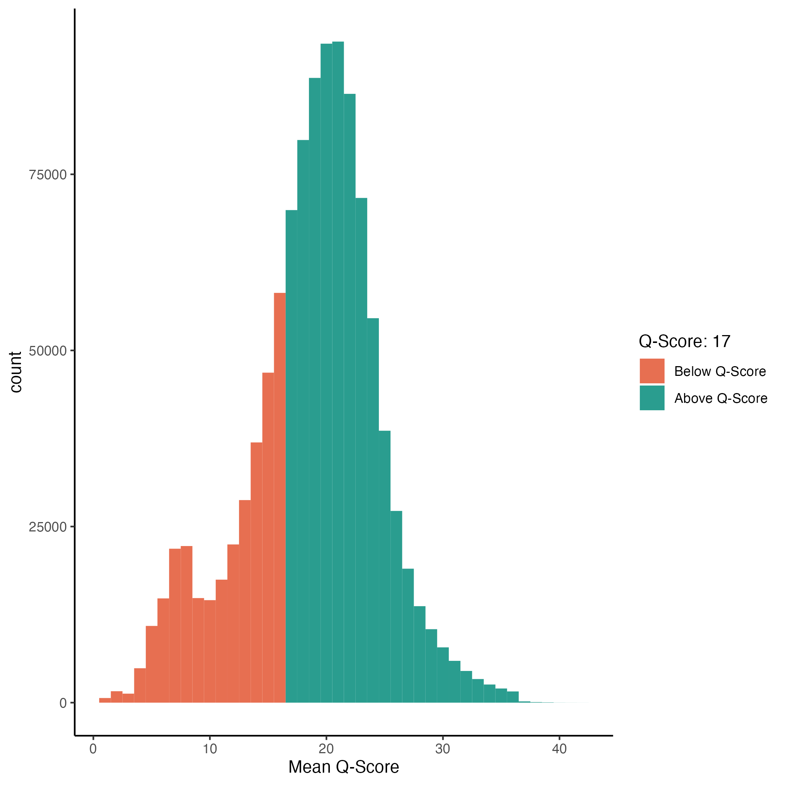

# DoradoQC: Statistical Analysis of Dorado Summary Files

## Dependencies

```{Required Libraries:}
ggplot2
readxl
tools
ggExtra
dplyr


Install Script for R: 
install.packages(c("ggplot2","readxl", "tools", "ggExtra", "dplyr"))

```


## Execution: 

```{Execution}
Rscript <path/to/DoradoQC_simplex.R> <path/to/summary_file(s)>
Example:
 Rscript ~/DoradoStats/DoradoQC_simplex.R ~/DoradoStats/bp_g1_summary
```

## Output
DoradoQC_Simplex will currently output four graphs:
### Mean Quality Score Histogram


